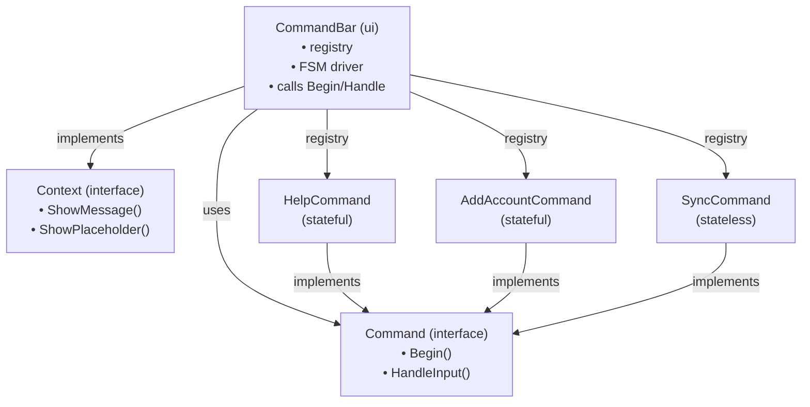

```mermaid
graph TD

    CB["CommandBar (ui)\n• registry\n• FSM driver\n• calls Begin/Handle"]

    CMD_IF["Command (interface)\n• Begin()\n• HandleInput()"]

    CTX_IF["Context (interface)\n• ShowMessage()\n• ShowPlaceholder()"]

    HELP["HelpCommand\n(stateful)"]
    ADD["AddAccountCommand\n(stateful)"]
    SYNC["SyncCommand\n(stateless)"]

    %% Registry
    CB -->|"registry"| HELP
    CB -->|"registry"| ADD
    CB -->|"registry"| SYNC

    %% Interface usage
    CB -->|"uses"| CMD_IF

    HELP -->|"implements"| CMD_IF
    ADD -->|"implements"| CMD_IF
    SYNC -->|"implements"| CMD_IF

    %% Context implementation
    CB -->|"implements"| CTX_IF

```